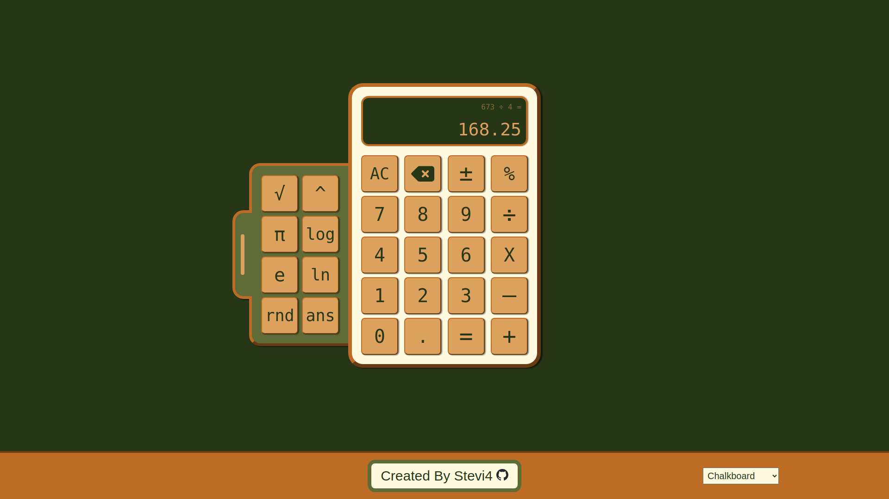

# Calculator
An interactive calculator built using HTML5, CSS3, and JavaScript ES6.

[Live Preview](https://stevi4.github.io/Calculator/)

## About
### Features
- Functional calculator
  - Includes all standard operations (Addition, Subtraction, Multiplication, Division)
  - Includes percentage & change sign operations
  - Allows decimal inputs
  - Robust handling of errors & fitting numbers to the display
- Extendable calculator tab
  - Includes several additional operations
  - Includes button to insert the most recent evaluation result
  - CSS animation when toggling the tab
- Theme selection to change the page's color scheme
- Full keyboard support ([Keybindings listed here](Keybinds.md))
### Limitations
- Number display is limited to 12 characters long (Not including sign or operators)
- Not optimized for mobile
### Tools Used
- Visual Studio Code
- Git & Github
- Canva (for color schemes)
## Acknowledements
Inspired by [The Odin Project's](https://www.theodinproject.com/) Foundations course.
## License
[MIT](LICENSE)
©2024 Stevi4
